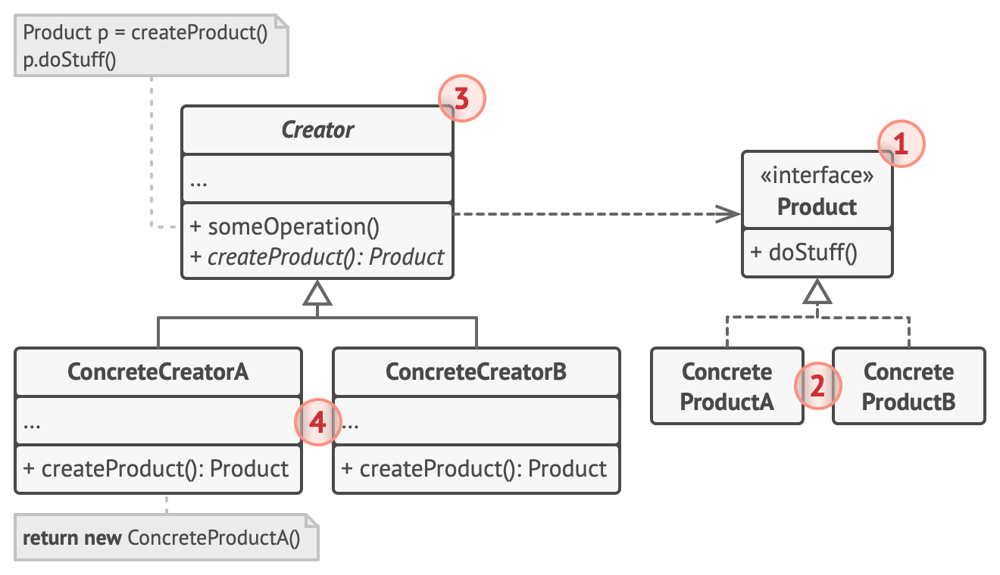

# Factory Method

## 1. 의도

- 부모 클래스에서 객체들을 생성할 수 있는 인터페이스를 제공하지만, 자식 클래스들이 생성될 객체들의 유형을 변경할 수 있도록 하는 생성 패턴
- 모든 제품 클래스들이 공통 인터페이스를 구현하는 한, 제품 클래스들의 객체들을 손상하지 않고 클라이언트 코드를 통과시킬 수 있습니다.

## 2. 구조

### 1\) Product (interface)

- 인터페이스 형식으로 지정됨
- 즉 모든 메소드 구현되어야 함

### 2\) Concrete Product A, B, C...

- concrete 란 abstract 의 반대말로 구현체를 의미함

### 3\) Creator (concrete or abstract)

- 새로운 Product 군을 반환하는 팩토리 메서드를 가져야한다
- 이 팩토리 메서드의 리턴 값은 Product 인터페이스이다.
- creator를 추상 클래스로 정의할 수도 있다
- 생성된 제품을 활용하는 핵심 메소드가 존재한다.

### 4\) Concrete Creator

- 추상 creator 클래스의 팩토리 메서드를 재정의 하여 Concrete creator 마다 다른 Product 를 생성한다.

## 3. 적용
