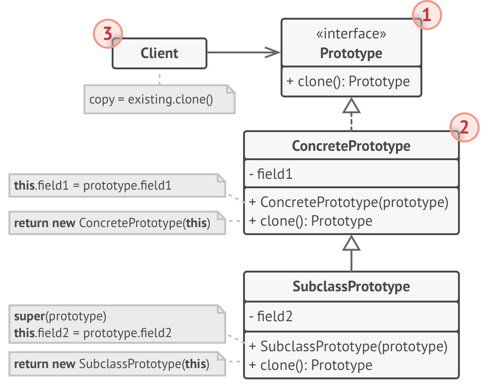

# Prototype

## 1. 의도

- 프로토타입은 코드를 그들의 클래스들에 의존시키지 않고 기존 객체들을 복사할 수 있도록 하는 생성 디자인 패턴이다
- 프로토타입 패턴은 실제로 복제되는 객체들에 복제 프로세스를 위임한다. 페턴은 복제를 지원하는 모든 객체에 대한 공통 인터페이스를 선언한다.
- 복제를 지원하는 객체를 프로토타입 이라고 한다.
- 실제 산업의 프로토타입과 의미가 다름, 세포 분열의 원시 세포가 더 맞음

## 2. 구조

### 2.1 기초 구현

### 1\) Prototype Interface

- 프로토타입 인터페이스는 복제 메서드들을 선언하며, 이 메서드들의 대부분은 단일 clone 메서드 이다.

### 2\) Concrete Prototype

- 구상 프로토타입 클래스는 복제 메서드를 구현함. 원본 객체의 데이터를 복제본에 복사하는 것 외에도 이 메서드는 복제 프로세스와 관련된 일부 예외적인 경우들도 처리 할 수 있다. (예: 연결된 객체 복제, 재귀 종속성 풀기)

### 3\) Client

- 클라이언트는 프로토타입 인터페이스를 따르는 모든 객체의 복사본을 생성할 수 있다.

### 2.2 프로토 타입 레지스트리 구현

### 1\) Prototype Registry

- 프로토타입 레지스트리는 자주 사용하는 프로토타입들에 쉽게 접근하는 방법을 제공한다.
- 이 레지스트리는 복사될 준비가 된 미리 만들어진 객체들의 집합을 저장한다.
- 가장 간단한 프로토타입 레지스트리는 name > prototype 해시 맵이다.
- 단순히 이름을 검색하는 것보다 더 나은 검색 기준이 필요한 경우 훨씬 더 탄탄한 레지스트리를 구축할 수 있다.

## 3. 적용
